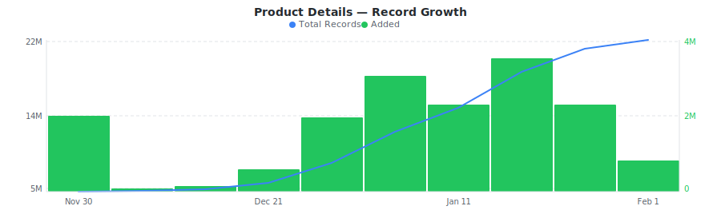

# Shopee Product Listings Dataset

&nbsp;&nbsp;[](https://rebrowser.net/products/datasets/shopee)

Daily snapshots of Shopee product listings across Taiwan and Southeast Asian marketplaces with variant pricing, seller metrics, ratings, and shipping data.


This repository contains a preview sample of the [Shopee dataset](https://rebrowser.net/products/datasets/shopee) published by Rebrowser. If you're doing academic research, you may be eligible for free access to a much larger slice — see [Free Datasets for Research](https://rebrowser.net/free-datasets-for-research).


This dataset contains **1** entity, each in its own folder: Product Details (`product-details`). See below for a full field breakdown, sample counts, and data distributions for each.

*Found this useful? ⭐ Star this repo to help us keep publishing fresh data. Found an error? [Let us know](https://rebrowser.net/contact-us).*


---

### Product Details
Shopee product listings with variant pricing, discount percentages, seller ratings, shop metrics, shipping options, and category data across Southeast Asian marketplaces.


> **22,149,456** total records from 2025-10-26 to 2026-02-01, **up to 30,000** rows in this sample (0.14% of full dataset).
> Exported as one file per day, up to 1,000 rows each, last 30 days retained.



| Field | Type | Fill Rate | Description |
| --- | --- | --- | --- |
| `_primaryKey` | `string` | 100% | Unique identifier for this record |
| `_firstSeenAt` | `datetime` | 100% | First time this record was seen |
| `_lastSeenAt` | `datetime` | 100% | Last time this record was updated |
| `itemId` | `string` | 100% | Unique Shopee product ID |
| `shopId` | `string` | 100% | Shopee shop/seller ID |
| `title` | `string` | 100% | Product title/name |
| `description` | `string` | 95% | Product description text |
| `status` | `string` | 100% | Item status (normal, banned, deleted) |
| `condition` | `float` | 100% | Product condition (1 = new, 2 = used) |
| `catId` | `float` | 100% | Primary category ID |
| `categories` | `json` | 100% | Array of category objects with catid and display_name |
| `brand` | `string` | 20% | Product brand name |
| `brandId` | `float` | 20% | Brand ID |
| `currency` | `string` | 100% | Currency code (TWD, MYR, SGD, etc.) |
| `price` 🔒 | `float` | 100% | Current price (raw value from API, typically multiplied by 100000) |
| `priceMin` | `float` | 100% | Minimum price for products with variants (raw value) |
| `priceMax` | `float` | 100% | Maximum price for products with variants (raw value) |
| `priceBeforeDiscount` 🔒 | `float` | 92% | Original price before discount (raw value) |
| `priceMinBeforeDiscount` 🔒 | `float` | 100% | Minimum price before discount for variants (raw value) |
| `priceMaxBeforeDiscount` 🔒 | `float` | 100% | Maximum price before discount for variants (raw value) |
| `discount` | `float` | 100% | Discount percentage (0-100) |
| `ratingAvg` | `float` | 100% | Average rating (0-5 stars) |
| `ratingCount` | `float` | 100% | Total number of ratings |
| `commentCount` | `float` | 100% | Number of reviews/comments |
| `likedCount` | `float` | 100% | Number of likes/favorites |
| `shopLocation` | `string` | 97% | Seller location/city |
| `isAdult` | `bool` | 100% | Whether product is adult-only |
| `isPreOrder` | `bool` | 100% | Whether product is pre-order |
| `estimatedDays` | `float` | 100% | Estimated shipping/processing days for pre-order |
| `isFreeShipping` | `bool` | 100% | Whether free shipping is available |
| `isServiceByShopee` | `bool` | 100% | Whether fulfilled by Shopee (FBS) |
| `images` | `array` | 100% | Array of all product image IDs |
| `models` 🔒 | `json` | 100% | Array of product variants/SKUs with fields: item_id, name, promotion_id, price, price_before_discount, model_id, is_clickable, is_grayout, stock |
| `createdAt` | `datetime` | 100% | Product creation timestamp |
| `shopName` | `string` | 100% | Shop/seller name |
| `shopRating` | `float` | 84% | Shop average rating (0-5) |
| `shopResponseRate` | `float` | 98% | Shop response rate percentage (0-100) |
| `shopResponseTime` | `float` | 100% | Average shop response time in seconds |
| `shopFollowerCount` | `float` | 100% | Number of shop followers |
| `shopItemCount` | `float` | 100% | Number of products in shop |
| `shopCreatedAt` | `datetime` | 100% | Shop creation timestamp |
| `isOfficialShop` | `bool` | 100% | Whether shop is official/verified |
| `shopRatingGood` | `float` | 100% | Number of positive shop ratings |
| `shopRatingNormal` | `float` | 100% | Number of neutral shop ratings |
| `shopRatingBad` | `float` | 100% | Number of negative shop ratings |
| `isShopeeVerified` | `bool` | 100% | Whether shop is Shopee verified |
| `shopDetailedLocation` | `string` | 97% | Shop location from shop details |
| `isIndividualSeller` | `bool` | 0% | Whether seller is an individual (not a business) |
| `isMart` | `bool` | 0% | Whether product is from Shopee Mart |
| `shippingFeeMin` | `float` | 100% | Minimum shipping fee (raw value) |
| `modelsCount` | `float` | 100% | Number of product variants/SKUs |
| `productUrl` 🔒 | `string` | 100% | Full URL to the Shopee product page |


> 🔒 **Premium fields** are included in the data files but their values are replaced with `[PREMIUM]`. To access real values, [use our website](https://rebrowser.net/products/datasets/shopee).


#### Field Distributions


<details>
<summary><strong>Products by Currency (Market)</strong> (<code>currency</code>)</summary>


| Value | Count | Share |
| --- | --- | --- |
| TWD | 22,149,456 | `████████████████████` 100.0% |

</details>


<details>
<summary><strong>Item Status Distribution</strong> (<code>status</code>)</summary>


| Value | Count | Share |
| --- | --- | --- |
| normal | 17,276,123 | `████████████████░░░░` 78.0% |
| new | 3,057,410 | `███░░░░░░░░░░░░░░░░░` 13.8% |
| banned | 1,809,162 | `██░░░░░░░░░░░░░░░░░░` 8.2% |
| offensive_hide | 6,761 | `░░░░░░░░░░░░░░░░░░░░` 0.0% |

</details>


<details>
<summary><strong>Product Condition (New vs Used)</strong> (<code>condition</code>)</summary>


| Value | Count | Share |
| --- | --- | --- |
| New | 22,007,301 | `████████████████████` 99.4% |
| 4 | 138,845 | `░░░░░░░░░░░░░░░░░░░░` 0.6% |
| 0 | 3,310 | `░░░░░░░░░░░░░░░░░░░░` 0.0% |

</details>


---

## Pre-built Views on Rebrowser

Rebrowser web viewer lets you filter, sort, and export any slice of this dataset interactively. These pre-built views are ready to open:


### Product Details


[Products with Customer Ratings](https://rebrowser.net/products/datasets/shopee/product-details/views/products-with-ratings) — 2,966,336 records

↳ `[{"field":"ratingCount","op":"gt","value":10},{"sort":"ratingCount DESC"}]`

[All Products](https://rebrowser.net/products/datasets/shopee/product-details/views/products-database) — 31,293,618 records

↳ `[{"sort":"createdAt DESC"}]`

[Products with Active Discounts](https://rebrowser.net/products/datasets/shopee/product-details/views/products-with-discount) — 10,490,841 records

↳ `[{"field":"discount","op":"gte","value":10},{"sort":"discount DESC"}]`

[Products with Free Shipping](https://rebrowser.net/products/datasets/shopee/product-details/views/free-shipping-products) — 406,511 records

↳ `[{"field":"isFreeShipping","op":"isTrue"},{"sort":"likedCount DESC"}]`

[Official Shop Products](https://rebrowser.net/products/datasets/shopee/product-details/views/official-shop-products) — 1,177,095 records

↳ `[{"field":"isOfficialShop","op":"isTrue"},{"sort":"shopItemCount DESC"}]`


*[See all 20 views →](https://rebrowser.net/products/datasets/shopee/product-details)*


---

## Code Examples

```python
import pandas as pd
from pathlib import Path

# Load the last 7 days of Shopee product snapshots
files = sorted(Path('rebrowser/shopee-dataset/product-details/data').glob('*.parquet'))[-7:]
df = pd.concat([pd.read_parquet(f) for f in files])

# Top 20 brands by number of listings
print(df['brand'].value_counts().head(20).to_string())

# Average rating and review count by currency (market)
market_stats = df.groupby('currency').agg(
    avg_rating=('ratingAvg', 'mean'),
    avg_reviews=('commentCount', 'mean'),
    listings=('itemId', 'count')
).sort_values('listings', ascending=False)
print(market_stats.to_string())

# Products with the deepest discounts (30%+)
deep_discounts = df[df['discount'] >= 30].sort_values('discount', ascending=False)
print(deep_discounts[['title', 'brand', 'currency', 'priceMin', 'discount', 'ratingAvg']].head(20)
      .to_string(index=False))

# Top shops by follower count
top_shops = (df.drop_duplicates('shopId')
             .nlargest(15, 'shopFollowerCount')
             [['shopName', 'shopRating', 'shopFollowerCount', 'shopItemCount']])
print(top_shops.to_string(index=False))
```

---

## Use Cases


### Pricing Strategy Research

Compare variant-level pricing across sellers and categories to identify discount patterns and competitive positioning on Shopee marketplaces.


### Seller Benchmarking

Rank shops by ratings, response rates, follower counts, and product volume. Identify traits that distinguish top-performing Shopee sellers.


### Market Entry Analysis

Evaluate product density, competition levels, and pricing ranges by category and currency to assess expansion opportunities across Southeast Asian markets.


### Promotion Pattern Detection

Study discount percentages, pre-order adoption, and free shipping rates across product categories to understand promotional dynamics.


---

## Full Dataset on Rebrowser


This repo is a 1,000-row preview sample. The full dataset is at [rebrowser.net/products/datasets/shopee](https://rebrowser.net/products/datasets/shopee)

Doing academic research? You may qualify for free access to a larger slice. See [Free Datasets for Research](https://rebrowser.net/free-datasets-for-research).

On Rebrowser you can:
- **Filter before you buy** — use the web UI to apply filters on any field and sort by any column. Preview results before purchasing. You only pay for records that match your criteria.
- **Export in your format** — CSV, JSON, JSONL, or Parquet depending on your plan.
- **Access via API** — integrate dataset queries into your pipelines and workflows.
- **Choose your freshness** — plans range from a 14-day lag to real-time data with no delay.
- **Select only the fields you need** — keep exports lean. Premium fields with richer data are available on higher plans.

[Pricing](https://rebrowser.net/pricing) starts at **$2 per 1,000 rows** with volume discounts.

---

## License & Terms

**Free for research and non-commercial use** with attribution. See [license terms](https://rebrowser.net/free-datasets-for-research#license) and [how to cite](https://rebrowser.net/free-datasets-for-research#citation).

```bibtex
@misc{rebrowser_shopee,
  author       = {Rebrowser},
  title        = {Shopee Product Listings Dataset},
  year         = {2026},
  howpublished = {\url{https://rebrowser.net/products/datasets/shopee}},
  note         = {Accessed: YYYY-MM-DD}
}
```

Commercial use requires a paid license — see [pricing](https://rebrowser.net/pricing). Use of this data is governed by the [Rebrowser Terms of Use](https://rebrowser.net/terms-of-use), which may be updated at any time independently of this repository.

---

## Disclaimer

Rebrowser is an independent data provider and is not affiliated with, endorsed by, or sponsored by Shopee. Any trademarks are the property of their respective owners. This dataset is compiled from publicly available information; we do not request or collect Shopee user credentials. By using this dataset, you agree to comply with Shopee's Terms of Service and all applicable laws and regulations. Images, logos, descriptions, and other materials included in this dataset remain the intellectual property of their respective owners and are provided solely for informational purposes. Rebrowser makes no warranties regarding the accuracy, completeness, or legality of the data and assumes no liability for how the data is used. You are solely responsible for ensuring that your use of this dataset does not infringe on the rights of any third party.


You can also find this data on [Kaggle](https://www.kaggle.com/datasets/rebrowser/shopee-dataset), [HuggingFace](https://huggingface.co/datasets/rebrowser/shopee-dataset), [Zenodo](https://doi.org/10.5281/zenodo.18854854).


